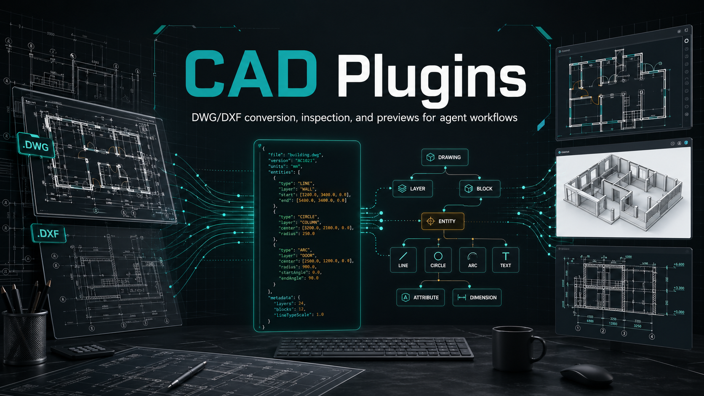
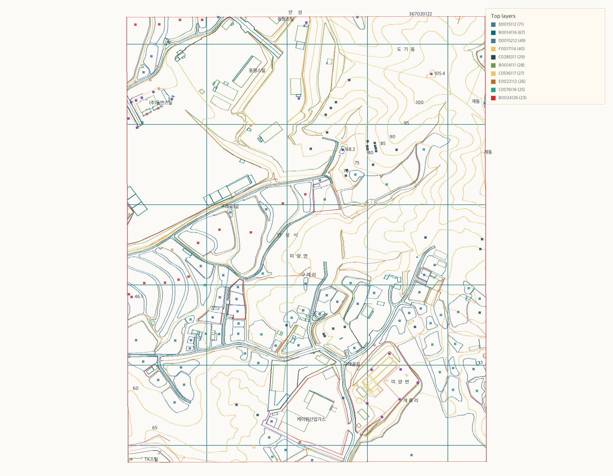
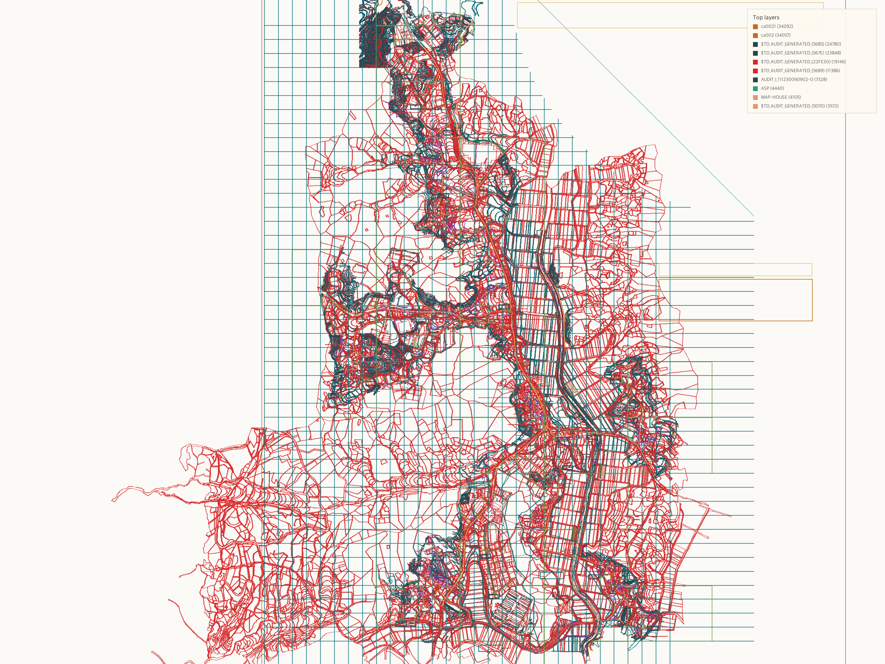
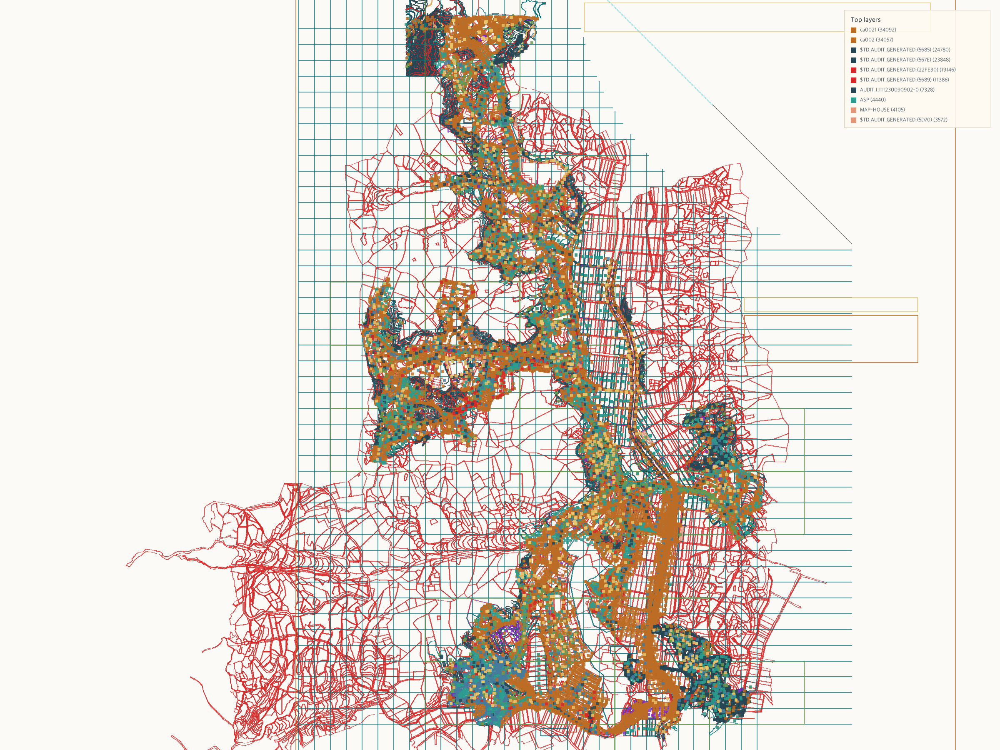

<p align="center">
  
</p>

<h1 align="center">CAD Plugins</h1>

<p align="center">
  <strong>DWG/DXF 변환, 빠른 요약, 집중 검사, 읽기 쉬운 프리뷰를 위한 에이전트 친화 CAD 스킬과 Python 유틸리티입니다.</strong>
</p>

<p align="center">
  <a href="https://github.com/GirinMan/cad-plugins/blob/main/LICENSE"></a>
  
  
  
  
</p>

<p align="center">
  <strong>한국어</strong> |
  <a href="README.md">English</a>
</p>

<p align="center">
  <a href="#빠른-시작">빠른 시작</a> |
  <a href="#스킬">스킬</a> |
  <a href="#자주-쓰는-명령">명령</a> |
  <a href="#예시">예시</a> |
  <a href="#권장-에이전트-워크플로우">워크플로우</a>
</p>

---

## 왜 만들었나요

CAD 파일은 단순한 그림이 아닙니다. 하나의 도면 안에도 중첩 블록, 레이어, 치수, 라벨, 속성, 보조선, 거대한 좌표계가 함께 들어갈 수 있습니다. `CAD Plugins`는 에이전트가 CAD 파일을 실용적으로 다룰 수 있도록 다음 흐름을 제공합니다.

- 원본 DWG/DXF 입력을 보존합니다.
- 필요한 경우 DWG를 표준 작업 형식인 DXF로 정규화합니다.
- CAD 구조를 주석 정보가 살아 있는 JSON으로 파싱합니다.
- 모든 정보를 한 장의 복잡한 스크린샷으로 뭉개지 않고 목적별 프리뷰를 렌더링합니다.
- 레이어, 블록, 텍스트, 엔티티 타입, 키워드, 좌표 영역 기준으로 필요한 정보만 검사합니다.

## 스킬

| 영역 | 경로 | 목적 |
| --- | --- | --- |
| 변환 | `skills/cad-convert` | DWG/DXF 입력을 표준 DXF로 정규화하고 결과를 검증합니다. |
| 빠른 확인 | `skills/cad-quicklook` | CAD 비전문가도 이해할 수 있는 1차 요약을 만듭니다. |
| 렌더링 | `skills/cad-render` | CAD 분석 JSON에서 읽기 쉬운 PNG/SVG/HTML 프리뷰를 생성합니다. |
| 검사 | `skills/cad-inspect` | 레이어, 라벨, 블록, 엔티티, 영역에 대한 집중 질문에 답합니다. |
| Python 유틸리티 | `cad_parser/` | 스킬에서 사용하는 변환, 파싱, 모델링, 시각화 공통 코드입니다. |

## 빠른 시작

```bash
git clone https://github.com/GirinMan/cad-plugins.git
cd cad-plugins

python3 --version  # Python 3.10+ 필요
python3 -m venv .venv
source .venv/bin/activate

python -m pip install -U pip
python -m pip install -r requirements.txt
python -m unittest discover -v
```

macOS의 `python3`가 시스템 Python 3.9를 가리킨다면 `python3.13 -m venv .venv`처럼 더 최신 인터프리터를 사용하세요.

Windows PowerShell:

```powershell
git clone https://github.com/GirinMan/cad-plugins.git
cd cad-plugins

py -3.11 -m venv .venv
.\.venv\Scripts\Activate.ps1

python -m pip install -U pip
python -m pip install -r requirements.txt
python -m unittest discover -v
```

Python 3.10 이상이면 어떤 인터프리터든 사용할 수 있습니다. `py -3.11`은 Windows에서 쓰기 쉬운 예시입니다.

## 스킬로 설치하기

Codex 로컬 스킬 설치:

```bash
mkdir -p ~/.codex/skills
cp -R skills/cad-* ~/.codex/skills/
```

Claude 호환 로컬 스킬 복사:

```bash
mkdir -p ~/.claude/skills
cp -R skills/cad-* ~/.claude/skills/
```

Windows PowerShell:

```powershell
New-Item -ItemType Directory -Force "$env:USERPROFILE\.codex\skills"
Copy-Item -Recurse -Force .\skills\cad-* "$env:USERPROFILE\.codex\skills\"

New-Item -ItemType Directory -Force "$env:USERPROFILE\.claude\skills"
Copy-Item -Recurse -Force .\skills\cad-* "$env:USERPROFILE\.claude\skills\"
```

플러그인 매니페스트는 `.codex-plugin/plugin.json`에 있으며 `./skills/`를 가리킵니다.

## CAD 변환기 의존성

DXF 파일은 Python만으로 바로 파싱할 수 있습니다. DWG 변환에는 로컬 변환기가 필요합니다.

권장 DWG 변환기:

- macOS와 Windows에서는 [ODA File Converter](https://www.opendesign.com/guestfiles/oda_file_converter)를 권장합니다.
- LibreDWG `dwgread`도 설치되어 있다면 오픈소스 대체 경로로 사용할 수 있으며, 파일별 검증을 함께 수행합니다.

macOS ODA 경로 예시:

```bash
export CAD_PARSER_ODA_PATH="/Applications/ODAFileConverter.app/Contents/MacOS/ODAFileConverter"
python -m cad_parser.convert --check
```

Windows ODA 경로 예시:

```powershell
$env:CAD_PARSER_ODA_PATH = "C:\Program Files\ODA\ODAFileConverter\ODAFileConverter.exe"
python -m cad_parser.convert --check
```

Windows 설치 파일이 필요하면 아래 ODA File Converter MSI를 먼저 설치하세요.

<https://www.opendesign.com/guestfiles/get?filename=ODAFileConverter_QT6_vc16_amd64dll_27.1.msi>
Windows에서 이후 셸에도 유지하려면 다음처럼 사용자 환경 변수로 저장할 수 있습니다.

```powershell
[Environment]::SetEnvironmentVariable(
  "CAD_PARSER_ODA_PATH",
  "C:\Program Files\ODA\ODAFileConverter\ODAFileConverter.exe",
  "User"
)
```

## 자주 쓰는 명령

변환기 사용 가능 여부 확인:

```bash
python -m cad_parser.convert --check
```

DWG 하나를 표준 DXF로 변환:

```bash
python -m cad_parser.convert input.dwg \
  --out data/intermediate/input.dxf \
  --manifest data/processed/input_conversion_manifest.json
```

DXF 또는 DWG를 JSON과 PNG로 분석:

```bash
python -m cad_parser.cli input.dxf \
  --out data/processed/input_analysis.json \
  --png-out data/processed/input_preview.png \
  --png-width 2400 \
  --png-height 1800 \
  --png-clip-percentile 0.01
```

기존 JSON 분석 결과에서 다시 렌더링:

```bash
python -m cad_parser.visualize data/processed/input_analysis.json \
  --png-out data/processed/input_linework.png \
  --width 2400 \
  --height 1800 \
  --clip-percentile 0.01
```

## 예시

### B010 수치지도 DXF

이 샘플은 의미 있는 라벨과 레이어 중심 구조를 가진 지도형 DXF처럼 동작합니다. quicklook/render 흐름으로 만든 잘린 프리뷰는 더 깊은 라벨 검사를 하기 전에 전체 방향을 잡기에 좋습니다.



### 펌프장 계획 DWG

이 DWG는 먼저 DXF로 정규화한 뒤 CAD 기반 프리뷰로 렌더링합니다. 조밀한 도면은 전체를 한 장으로 보는 것보다 잘린 라인워크와 블록 인지 프리뷰로 나누어 보는 편이 더 읽기 쉽습니다.



블록 인지 프리뷰:



## 권장 에이전트 워크플로우

1. 모든 DWG/DXF 입력은 먼저 `cad-convert`로 시작해 이후 단계가 표준 DXF를 사용하게 합니다.
2. 사용자가 "이 파일이 뭐야?"라고 묻거나 짧은 요약이 필요하면 `cad-quicklook`을 사용합니다.
3. 도면을 눈으로 확인해야 할 때는 `cad-render`를 사용하되, 목적에 맞는 뷰를 선택합니다.
4. 키워드, 레이어, 블록, 좌표 영역, 시설 라벨처럼 대상이 구체적일 때만 `cad-inspect`를 사용합니다.

## 커밋하지 말아야 할 것

고객 CAD 원본, 큰 정규화 JSON 보고서, 생성된 중간 DXF 파일은 기본적으로 커밋하지 마세요. 공유해도 되는 공개 예시는 안전성을 확인한 뒤 `assets/examples/` 아래에 둡니다.

## 검증

변경사항을 공개하기 전에 다음 명령을 실행하세요.

```bash
python -m json.tool .codex-plugin/plugin.json >/dev/null
python -m unittest discover -v
python ~/.codex/skills/.system/skill-creator/scripts/quick_validate.py skills/cad-convert
python ~/.codex/skills/.system/skill-creator/scripts/quick_validate.py skills/cad-quicklook
python ~/.codex/skills/.system/skill-creator/scripts/quick_validate.py skills/cad-render
python ~/.codex/skills/.system/skill-creator/scripts/quick_validate.py skills/cad-inspect
```
